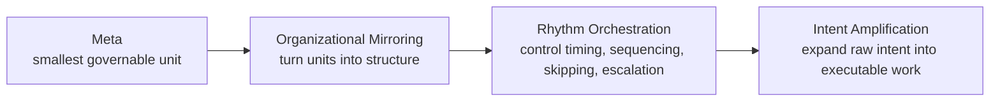
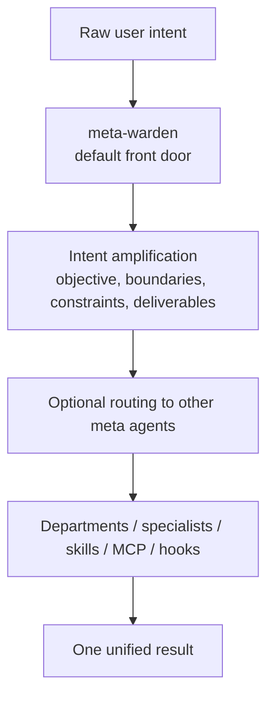
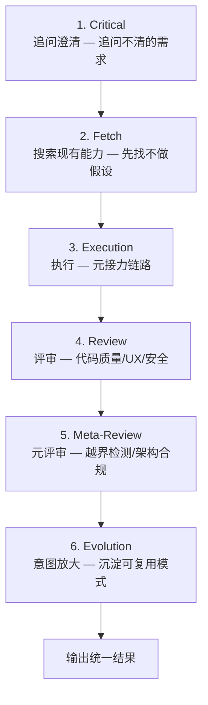

<div align="center">

<h1>Meta_Kim</h1>

<p>
  <a href="README.md">English</a> |
  <a href="README.zh-CN.md">简体中文</a>
</p>

<p>
  
  
  
  
</p>

**An open-source meta-architecture for intent amplification across Claude Code, Codex, and OpenClaw**

Meta_Kim is about teaching AI systems to organize complex work before they answer.

**Meta -> Organizational Mirroring -> Rhythm Orchestration -> Intent Amplification**

</div>

## Author and Support

<div align="center">
  
  <p>
    GitHub <a href="https://github.com/KimYx0207">KimYx0207</a> |
    𝕏 <a href="https://x.com/KimYx0207">@KimYx0207</a> |
    Website <a href="https://www.aiking.dev/">aiking.dev</a> |
    WeChat Official Account: <strong>老金带你玩AI</strong>
  </p>
  <p>
    Feishu knowledge base:
    <a href="https://my.feishu.cn/wiki/OhQ8wqntFihcI1kWVDlcNdpznFf">ongoing updates</a>
  </p>
</div>

<div align="center">
  <table align="center">
    <tr>
      <td align="center">
        
        <br/>
        <strong>WeChat Pay</strong>
      </td>
      <td align="center">
        
        <br/>
        <strong>Alipay</strong>
      </td>
    </tr>
  </table>
</div>

## At a Glance

- Default front door: `meta-warden`
- Organizational backbone: `8` meta agents
- Industry layer: `20` industries, `100` department agents, `1000` specialists
- Supported runtimes: Claude Code, Codex, OpenClaw
- Primary behavior: amplify intent first, then execute and coordinate
- Business run discipline: `one department -> one primary deliverable -> one closed handoff chain`

## Quick Start (Clone to Working in 5 Minutes)

### Prerequisites

- **Node.js** v18+ (for sync, validate, and OpenClaw scripts)
- **Git** (to clone)
- **Claude Code CLI** (optional, only needed for `eval:agents`)
- **OpenClaw CLI** (optional, only needed for `npm run prepare:openclaw-local`)

### Step 1: Clone & Install

```bash
git clone <this-repo>
cd Meta_Kim
npm install
```

### Step 2: Sync Runtimes

```bash
npm run sync:runtimes
```

This synchronizes the 8 meta agents from `.claude/agents/` to all three runtime mirrors (Claude Code, Codex, OpenClaw). Run this **every time you modify an agent definition or SKILL.md**.

### Step 3: Discover Global Capabilities

```bash
npm run discover:global
```

Scans and indexes your globally-installed capabilities across all three runtimes (Claude Code, OpenClaw, Codex), generating a unified capability index. **Required on first setup; re-run after installing new global capabilities.**

Scan scope:
- **Claude Code** (`~/.claude/`): agents, skills, hooks, plugins, commands
- **OpenClaw** (`~/.openclaw/`): agents, skills, hooks, commands
- **Codex** (`~/.codex/`): agents, skills, commands

### Step 4: Validate

```bash
npm run validate
```

Checks that all agent frontmatter is valid, SKILL.md is synced across all layers, and OpenClaw/Codex config is intact.

**Expected output:** `Validation passed for 8 agents.`

### Step 5: Run a Health Check

```bash
node scripts/agent-health-report.mjs
```

Gives you a quick read on all 8 agents: version, frontmatter completeness, boundary definitions, workspace files, skill sync status, and a composite health score.

### Step 6: Start Using (in Claude Code)

Open the repo with Claude Code and say:

```text
请以 meta-warden 为统一入口，先做意图放大，再判断是否需要调用其他元 agent。
```

Or describe a complex task directly — the system will automatically invoke the 8-stage governance flow.

## What This Project Is

Meta_Kim is not a chatbot product, not a SaaS app, not a single giant prompt, and not a folder full of disconnected agent files.

It is an engineering system built around one idea:

**raw intent should be amplified into executable work before the system starts answering.**

That means:

- the user starts with intent, not a finished specification
- the system first clarifies objective, boundaries, constraints, and deliverables
- work is routed through governable units instead of one giant undifferentiated context
- the same underlying discipline holds across Claude Code, Codex, and OpenClaw

At the engineering level, it organizes:

- `agents`: responsibility boundaries and organizational roles
- `skills`: reusable capability blocks
- `MCP`: external capability interfaces
- `hooks`: runtime rules and automation interception
- `memory`: long-term continuity and context policy
- `workspaces`: local runtime operating spaces
- `sync / validate / eval`: synchronization, validation, and acceptance tooling

## The Meta Philosophy

In Meta_Kim:

**meta = the smallest governable unit that exists to support intent amplification**

A valid meta unit must be:

- independently understandable
- small enough to stay controllable
- explicit about what it owns and refuses
- replaceable without collapsing the whole system
- reusable across workflows

Meta is an architectural unit here, not decoration.

## Core Method

Meta_Kim is built around one chain:

**Meta -> Organizational Mirroring -> Rhythm Orchestration -> Intent Amplification**



Each part solves a different problem:

- `Meta`: decomposition
- `Organizational Mirroring`: structure
- `Rhythm Orchestration`: timing and routing
- `Intent Amplification`: completion

## How the System Works

The default path is not “user asks -> model answers”.

It is:



The user-facing default is:

- `meta-warden`

The other seven meta agents are internal structure, not the public menu.

Every valid business run must keep a single organizing thread:

- one department
- one primary deliverable
- one closed handoff chain

If a plan bundles unrelated goals into the same run, `meta-conductor` should reject it and `meta-warden` should keep it out of public display.

## The Eight Meta Agents

- `meta-warden`: default entry, arbitration, synthesis
- `meta-conductor`: orchestration, sequencing, rhythm control
- `meta-genesis`: prompt identity, persona, `SOUL.md`
- `meta-artisan`: skills, MCP, tool and capability fit
- `meta-sentinel`: hooks, safety, permissions, rollback
- `meta-librarian`: memory, continuity, context policy
- `meta-prism`: quality review, drift detection, anti-slop checks
- `meta-scout`: external capability discovery and evaluation

## Runtime Entry Points

Meta_Kim keeps one operating logic while letting each runtime use its native interface.

| Runtime | Entry point | Main repo surface | Purpose |
| --- | --- | --- | --- |
| Claude Code | `CLAUDE.md` | `.claude/`, `.mcp.json` | Canonical editing runtime for meta agents, skills, hooks, and MCP |
| Codex | `AGENTS.md` | `.codex/`, `.agents/`, `codex/config.toml.example` | Codex-native agent and skill projection |
| OpenClaw | `openclaw/workspaces/` | `openclaw/` | Local workspace agents and template config with the same governance logic |

## How To Use It

### The 8-Stage Governance Flow

Every complex task goes through this pipeline automatically:



**Three iron laws贯穿全程：**
- **Critical > 猜测** — 需求不清先追问，不假设
- **Fetch > 假设** — 先搜索验证，不假设存在
- **Review > 信任** — 任何产出必须评审，不信任单次结果

### Two Trigger Modes

**Mode 1 — Auto-trigger (recommended for complex tasks):**

Just describe a complex task. If it involves multi-file changes, the system **automatically** runs all 8 stages. No need to know the stages exist.

Example: `"帮我实现一个用户认证系统"` → governance flow activates automatically.

**Mode 2 — Manual specialist trigger:**

Explicitly name a meta agent when you know exactly what you need.

### Default trigger

- prompt identity or `SOUL.md`: `meta-genesis`
- skills, MCP, tool selection: `meta-artisan`
- hooks, permissions, rollback, safety: `meta-sentinel`
- memory and long-term context: `meta-librarian`
- workflow and timing: `meta-conductor`
- quality review: `meta-prism`
- external tools and ecosystem scan: `meta-scout`

### In Claude Code

Claude Code reads:

- `CLAUDE.md`
- `.claude/agents/`
- `.claude/skills/`
- `.mcp.json`

Example:

```text
Use meta-warden as the entry point, amplify the intent, then review this project architecture and propose next steps.
```

### In Codex

Codex reads:

- `AGENTS.md`
- `.codex/agents/`
- `.agents/skills/`

If you want local MCP wiring as well, use:

- `codex/config.toml.example`

### In OpenClaw

Prepare local state first:

```bash
npm install
npm run prepare:openclaw-local
```

Then run an agent directly:

```bash
openclaw agent --local --agent meta-warden --message "Amplify the intent first, then decide which meta agents to route to." --json --timeout 120
```

## Repository Structure

```text
Meta_Kim/
├─ .claude/        Canonical Claude Code source: agents, skills, hooks, settings
├─ .codex/         Codex-native agent and skill mirrors
├─ .agents/        Codex project-level skill mirror
├─ codex/          Codex global config example
├─ openclaw/       OpenClaw workspaces, template config, runtime mirrors
├─ images/         Public assets used by the README
├─ scripts/        Sync, validation, MCP, evaluation, OpenClaw helper, and agent health reporting scripts
├─ shared-skills/  Shared skill mirrors across runtimes
├─ AGENTS.md       Codex and cross-runtime guide
├─ CLAUDE.md       Claude Code guide
├─ .mcp.json       Claude Code project MCP entry
├─ README.md       English README
└─ README.zh-CN.md Chinese README
```

Local-only ignored folders are not part of the public release surface:

- `docs/`
- `image/`
- `node_modules/`

### Why There Is a `codex/` Folder

Codex uses two configuration layers:

- repo-local assets, which live in `.codex/` and `.agents/`
- user-global configuration, which cannot live directly inside the repository root

So:

- `.codex/` is the repo content Codex reads directly
- `codex/` is only the example directory for wiring `~/.codex/config.toml`

- Automotive
- Travel & Hospitality
- Biotech
- Public Sector

### Department archetypes

- `strategy-office`
- `growth-operations`
- `product-delivery`
- `risk-compliance`
- `research-intelligence`

## Commands

### `npm install`

Run this after cloning if you want to use or validate the repo locally.

### `npm run sync:runtimes`

Run this after changing canonical agents, skills, or runtime-facing config. It rebuilds the runtime mirrors for Claude Code, Codex, and OpenClaw.

### `npm run discover:global`

Run this to scan and index your globally-installed capabilities across all three runtimes:

- **Claude Code** (`~/.claude/`): agents, skills, hooks, plugins, commands
- **OpenClaw** (`~/.openclaw/`): agents, skills, hooks, commands
- **Codex** (`~/.codex/`): agents, skills, commands

Generates `.claude/capability-index/global-capabilities.json` for use by the meta-theory skill's Fetch phase. This allows the meta architecture to see and integrate with your global capabilities.

### `npm run validate`

Run this to validate the canonical source files, agent definitions, SKILL.md sync, and OpenClaw/Codex configuration integrity.

### `npm run eval:agents`

Run this for runtime-level acceptance testing. It spawns each of the 8 meta agents and validates their boundary behavior against predefined test cases.

### `npm run verify:all`

Run this before publishing, shipping, or after substantial runtime changes. It performs the full validation and acceptance pass (validate + eval combined).

### `npm run prepare:openclaw-local`

Run this only if you want to execute the OpenClaw side on your own machine.

### `node scripts/agent-health-report.mjs`

Run this for a quick health check of all 8 meta agents. Outputs a markdown report covering version, frontmatter completeness, boundary definitions, workspace files, skill sync status, and overall health score.

## Simplest Starting Path

The [Quick Start section](#quick-start-clone-to-working-in-5-minutes) above gets you from clone to working in 5 minutes.

For reading order if you just want to understand:

1. `README.md` (this file) — start here
2. `CLAUDE.md` — Claude Code specific guide
3. `AGENTS.md` — Codex and cross-runtime guide

For the industry agent library:

- `factory/agent-library/`
- `factory/flagship-complete/agents/`
- `factory/runtime-packs/`

## Paper and Method Basis

The methodological basis comes from the evaluation work on meta-based intent amplification.

- Paper: <https://zenodo.org/records/18957649>
- DOI: `10.5281/zenodo.18957649`

The paper explains the method.  
This repository turns that method into runtime-ready engineering assets.

## License

This project is released under [CC BY 4.0](https://creativecommons.org/licenses/by/4.0/).

You may share and adapt it as long as attribution is preserved and changes are clearly marked.
