# Meta_Kim 完整架构图

本文是维护者视角的 Meta_Kim 架构图。中文为主，英文路径和运行时名称保留原名，方便直接对应仓库文件。

## 生成口径

- Critical：本图描述仓库架构，不描述某一次具体业务运行。
- Fetch：依据 `AGENTS.md`、`README.zh-CN.md`、`config/sync.json`、`config/capability-index/meta-kim-capabilities.json`、`config/contracts/workflow-contract.json`、`canonical/skills/meta-theory/references/`、`canonical/runtime-assets/`、`scripts/` 和 `graphify-out/GRAPH_REPORT.md`。
- Thinking：按“入口 -> 正典源 -> 能力发现 -> 运行时投影 -> 执行治理 -> 业务工作流 -> 安装更新 -> 记忆知识 -> 验证发布”的主链路组织。
- Review：所有箭头都对应仓库内真实目录、脚本或合约；运行时差异以能力边界呈现，不把某一运行时当成唯一真实源。

> 重要边界：8-stage spine 是 Meta_Kim 的最小执行骨架；11 阶段业务工作流是复杂任务的升级层。三层记忆也不是同一个系统：Claude Memory、Graphify、MCP Memory Service 的触发方式完全不同。

## 1. 总体分层架构

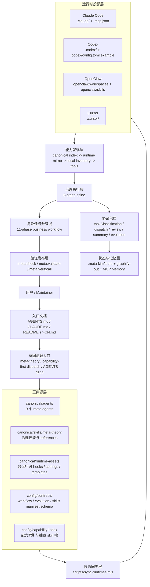

## 2. 能力优先调度链路

Meta_Kim 的执行入口不是“先点名某个 agent”，而是先定义能力缺口，再找 owner。

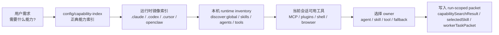

| 层级 | 代表文件或命令 | 作用 |
|---|---|---|
| 正典能力索引 | `config/capability-index/meta-kim-capabilities.json` | Meta_Kim 自己声明的长期能力边界 |
| Runtime mirror | `.claude/.codex/.cursor/openclaw/capability-index/` | 把同一份能力索引投影给不同宿主 |
| 本机 inventory | `npm run discover:global` | 扫描当前机器实际安装了哪些 agent / skill / runtime |
| 当前会话工具 | Codex tools / MCP tools / plugins | 执行本轮任务时真正可调用的能力 |
| run-scoped 选择 | governed run packets | 记录“这次用了谁”，不污染长期 agent 身份 |

这也是为什么 `superpowers`、`ecc`、`findskill` 只能作为能力提供者或搜索入口，不能被写死成某个 meta agent 的长期身份。

能力索引里的硬规则：

| 规则 | 说明 |
|---|---|
| `fetchOrder` | 必须按 `repo canonical capability index -> runtime mirror -> local global inventory -> fallback general agent with capability gap record` 查找 |
| `abstractCapabilitySlots` | 长期 agent 只能声明抽象能力槽，例如 run-scoped meta-skill selection |
| `runtimeSelectedSkills.selectedSkillScope` | 具体 child skill 只能是 `run_only`，不能写进 SOUL 或长期边界 |
| `longTermAgentIdentityPolicy` | 禁止把 `provider/*`、`provider:child-skill`、runtime-specific child skill id 固化进长期身份 |
| `executionBlock` | 9 个 meta agents 都是治理层，不能退化成普通执行工人 |
| fallback | 找不到 owner 时，用 general execution agent 或主线程降级，同时记录 `capabilityGapPacket` |

## 3. 正典源到运行时投影

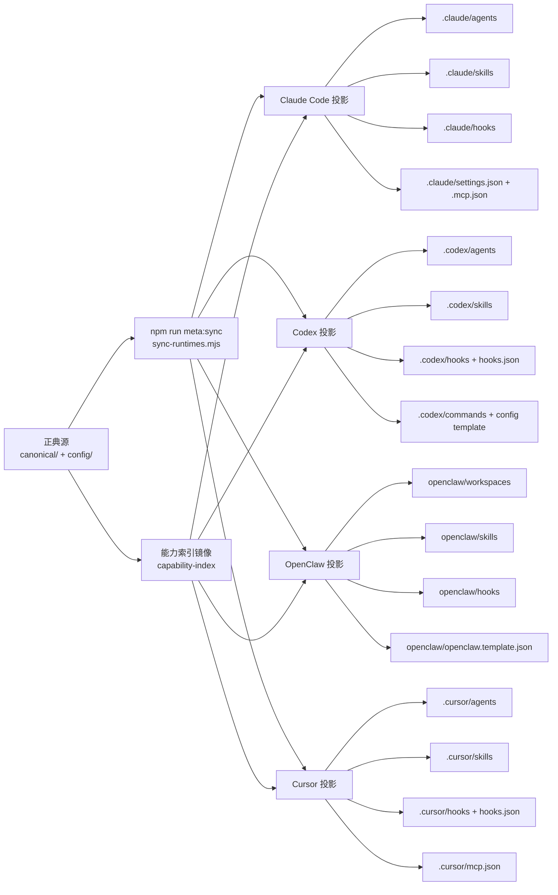

`config/sync.json` 的 cross-runtime 配置：

| 项 | 当前值 | 含义 |
|---|---|---|
| `availableTargets` | `claude`, `codex`, `openclaw`, `cursor` | 仓库支持生成的运行时 |
| `supportedTargets` | `claude`, `codex`, `openclaw`, `cursor` | 安装/同步脚本认可的运行时 |
| `defaultTargets` | `claude`, `codex`, `openclaw`, `cursor` | 默认全量同步目标 |
| `canonicalRoots.agents` | `canonical/agents` | 9 个 meta agent 的正典源 |
| `canonicalRoots.skills` | `canonical/skills` | `meta-theory` 等正典 skill |
| `canonicalRoots.runtimeAssets` | `canonical/runtime-assets` | hooks、settings、templates |
| `canonicalRoots.contracts` | `config/contracts` | workflow、evolution、manifest 合约 |
| `canonicalRoots.capabilityIndex` | `config/capability-index` | 能力索引正典源 |

Repo 默认目标和本机激活目标不同：

| 层 | 文件 | 用途 |
|---|---|---|
| Repo 默认 | `config/sync.json` | 开源仓库声明“可以生成什么、默认生成什么” |
| 本机覆盖 | `.meta-kim/local.overrides.json` | 当前机器实际启用哪些 runtime target |
| 用户 home 安装 | `~/.meta-kim/install-manifest.json` | 记录全局安装足迹和后续卸载/状态检查依据 |

## 4. 九个 Meta Agents 的治理拓扑

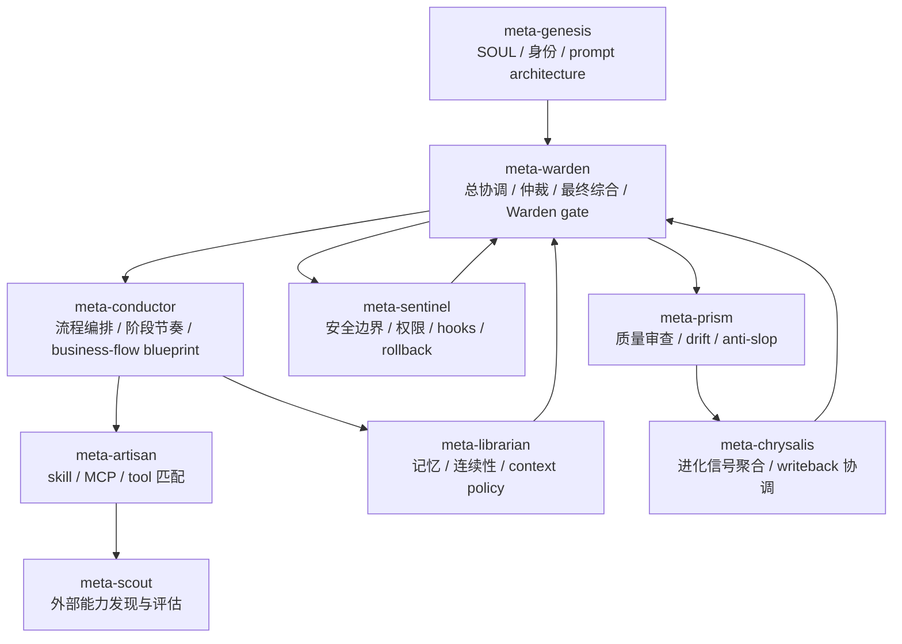

| Agent | 责任边界 | 不负责 |
|---|---|---|
| `meta-warden` | 总协调、仲裁、最终综合、Warden gate | 具体实现工作 |
| `meta-conductor` | 工作流、阶段节奏、业务流程蓝图 | 具体代码实现 |
| `meta-genesis` | 身份、SOUL、prompt 架构 | 工具匹配、安全审计 |
| `meta-artisan` | skill / MCP / tool 适配 | 人格设计、最终仲裁 |
| `meta-sentinel` | 安全、权限、回滚、hook 边界 | workflow 编排 |
| `meta-librarian` | 记忆、上下文、连续性 | skill 匹配、安全策略 |
| `meta-prism` | 质量审查、漂移检测、反 AI 味 | 直接执行 |
| `meta-scout` | 外部工具和能力发现 | 最终采纳决策 |
| `meta-chrysalis` | 进化信号和 writeback 协调 | 绕过 Warden 写回 |

## 5. Agent 命名与用户可见身份

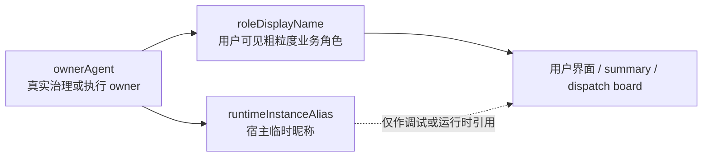

| 名称 | 示例 | 规则 |
|---|---|---|
| `ownerAgent` | `meta-conductor`, `frontend-developer` | 真实 owner，用于治理和 packet |
| `roleDisplayName` | `前端`, `后端`, `测试`, `frontend`, `backend` | 给用户看的短业务角色名，不能写具体工作项 |
| `runtimeInstanceAlias` | 宿主生成的临时昵称 | 不能作为主要 agent 名称展示 |

同一个 owner 并行多实例时，保持相同 `roleDisplayName`，用 `roleInstanceId`、`shardScope`、`parallelGroup`、`dependsOn`、`mergeOwner` 区分。

## 6. Governed Run 执行骨架：8-stage spine

```mermaid
flowchart LR
    Q["用户请求"] --> CR["Critical<br/>澄清阻塞与任务分类"]
    CR --> FE["Fetch<br/>能力发现：repo index / runtime mirror / global inventory / tools"]
    FE --> TH["Thinking<br/>方案比较 / owner / lanes / merge / review / verify"]
    TH --> EX["Execution<br/>分派执行或主线程执行窄任务"]
    EX --> RV["Review<br/>质量、边界、安全、测试审查"]
    RV --> MR["Meta-Review<br/>高风险时审查审查标准"]
    MR --> VE["Verification<br/>fresh checks / tests / sync / graphify"]
    VE --> EV["Evolution<br/>是否写回 canonical / contracts / capability index"]
    EV --> SUM["Summary<br/>交付闭环"]
```

8-stage spine 是所有 governed run 的执行骨架。它回答的是“这件事如何被判断、发现、执行、审查、验证和沉淀”。

| Stage | 主要 owner | 必须产物或证据 |
|---|---|---|
| Critical | Warden / Conductor | 任务分类、阻塞澄清、成功标准 |
| Fetch | Artisan / Scout / Librarian | 能力搜索、文件证据、图谱或记忆证据 |
| Thinking | Conductor | 方案比较、owner、并行组、merge/review/verify owner |
| Execution | 执行 owner | 代码、文档、配置或其它实际产物 |
| Review | Prism / Sentinel | finding、边界审查、安全和质量审查 |
| Meta-Review | Warden / Prism | 审查标准是否过松、过紧或漂移 |
| Verification | Prism / Warden | fresh checks、测试、同步、graphify 或 run artifact validation |
| Evolution | Chrysalis / Warden | retain / upgrade / retire / no-writeback 决策 |

## 7. 复杂任务升级层：11 阶段业务工作流

你指出的“8 大框架以外还有更长流程”就是这里。它不是替代 8-stage spine，而是在复杂任务上增加 run packaging、修订、反馈、进化和镜像发布。

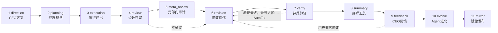

11 阶段的定义来源：

| 来源 | 作用 |
|---|---|
| `config/contracts/workflow-contract.json` | 机器可验证合约，列出 11 个 phase、label、terminal phase 和 publicDisplay gate |
| `canonical/skills/meta-theory/references/ten-step-governance.md` | 11 阶段逐阶段说明；文件名是历史兼容名，内容已是 11 阶段 |
| `canonical/skills/meta-theory/references/dev-governance.md` | 规定何时从 8-stage 升级到 11 阶段 |
| `scripts/validate-run-artifact.mjs` | 校验 governed run artifact 的 packets、summary、evolution、publicReady |
| `tests/meta-theory/07-contract-compliance.test.mjs` | 确认合约里确实有 11 个 phase |

它的真实运行位置：

| 机制 | 8-stage spine | 11 阶段业务工作流 |
|---|---|---|
| Runtime state machine | 真实存在，`spine-state.mjs` 维护 8 个 stage | 不存在第二套逐 phase runner |
| Hook enforcement | Claude 侧最强，Codex/Cursor/OpenClaw 较轻 | 通过 artifact/gate 间接体现 |
| Contract | `canonicalExecutionSpineStages` | `businessWorkflow.phases` |
| Artifact validation | required packets、review、verification、evolution | business flow blueprint、summary、feedback/evolve/mirror gates |
| 用户可见性 | 经常可见 | 复杂 run 或显式 full process 才应显式展示 |

为什么你会感觉“没见它跑过”：

1. 11 阶段不是后台自动流水线；它主要是合约和执行协议，需要一次 run 被分类为复杂任务或显式要求完整流程时才升级。
2. 小任务和中等任务会走 8-stage 或缩短路径，不会强行跑 `summary -> feedback -> evolve -> mirror`。
3. 当前 Codex/Claude 的聊天表面未必会把每个 business phase 都显式打印出来；更多证据落在 run artifact、planning files、summary/evolution packets 或验证命令里。
4. 如果没有创建或校验 governed run artifact，就很难从 UI 上看到完整 11 阶段闭环。

升级规则：

| 任务复杂度 | 默认路径 | 是否进入 11 阶段 |
|---|---|---|
| 1 个文件、纯逻辑/样式/说明 | 缩短的 owner-driven path | 否 |
| 2-5 个文件、单模块 | 完整 8-stage spine | 通常否 |
| 超过 5 个文件、跨系统、多团队、安全敏感、用户要求 full process | 8-stage + 11-phase upgrade | 是 |

8-stage 与 11 阶段不是一一对应的命名替换：

| 8-stage spine | 11 阶段业务工作流中的位置 |
|---|---|
| Critical | direction |
| Fetch + Thinking | planning |
| Execution | execution |
| Review + Meta-Review | review / meta_review / revision |
| Verification | verify / summary |
| Evolution | feedback / evolve / mirror |

## 8. 协议包与可审计状态

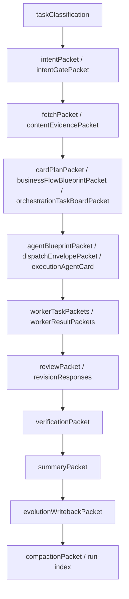

这些 packet 是“完整流程真的跑过”的主要证据。只看聊天文本，容易漏掉 11 阶段后半段。

| 分层 | Packet | 证明什么 |
|---|---|
| 入口类 | `runHeader`, `taskClassification`, `intentPacket`, `intentGatePacket` | 任务来源、分类、真实意图、用户选择或默认假设 |
| Fetch 类 | `fetchPacket`, `contentEvidencePacket`, `researchCapabilityDiscovery` | 是否先找证据、能力和可用 owner |
| 编排类 | `cardPlanPacket`, `businessFlowBlueprintPacket`, `orchestrationTaskBoardPacket` | lane、owner、并行组、依赖和交付物是否规划过 |
| 分发类 | `agentBlueprintPacket`, `dispatchEnvelopePacket`, `executionAgentCard`, `capabilityGapPacket` | owner 是否存在、缺口如何处理、memoryMode 和边界如何设定 |
| 执行类 | `workerTaskPackets`, `workerResultPackets` | 谁做了什么，结果是什么 |
| 审查类 | `reviewPacket`, `revisionResponses` | finding、证据、污染检查、修订回应 |
| 闭环类 | `verificationPacket`, `summaryPacket`, `evolutionWritebackPacket` | fresh verification、publicReady、writeback 决策 |
| 恢复类 | `compactionPacket`, `run-index.sqlite` | 跨会话恢复线索；不能替代 run artifact |

Public-ready gate 至少需要：

| 条件 | 含义 |
|---|---|
| `verifyPassed` | 验证通过 |
| `summaryClosed` | 总结闭合 |
| `singleDeliverableMaintained` | 没有多主交付物漂移 |
| `deliverableChainClosed` | 交付链闭合 |
| `consolidatedDeliverablePresent` | 有单一整合交付物 |

`deliveryShell` 决定摘要如何面向用户呈现；`silenceDecision` 决定何时不打扰用户；它们也是 contract 的一部分，不是 UI 文案小细节。

## 9. Planning Files 与 Packet 的关系

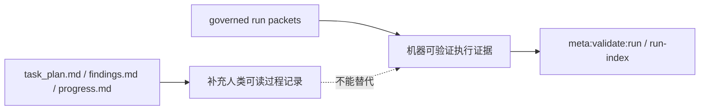

当 `planning-with-files` 可用且任务不是纯查询时，Stage 3 需要维护：

| 文件 | 作用 | 更新时机 |
|---|---|---|
| `task_plan.md` | phase roadmap、决策、错误 | 进入新阶段、状态变化、决策变化 |
| `findings.md` | Fetch 发现、技术判断、能力匹配 | 每 2 次搜索/读取后或有关键发现时 |
| `progress.md` | 执行日志、测试结果、错误记录 | 执行、Review、Verification 后 |

这些文件是工作记忆，不是正式合约。正式闭环仍以 `businessFlowBlueprintPacket`、`dispatchEnvelopePacket`、`reviewPacket`、`verificationPacket`、`summaryPacket`、`evolutionWritebackPacket` 为准。

## 10. 安装、更新、依赖与插件路径

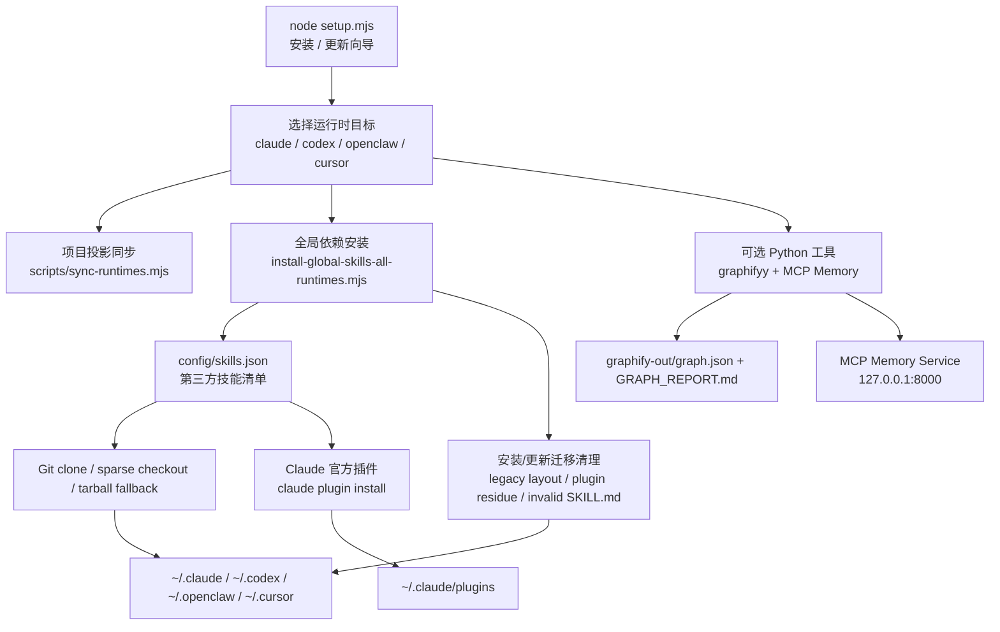

关键脚本：

| 脚本 | 作用 |
|---|---|
| `setup.mjs` | 交互式安装、更新、运行时选择、可选 graphify / memory |
| `scripts/sync-runtimes.mjs` | 把 canonical/config 投影到四个运行时 |
| `scripts/install-global-skills-all-runtimes.mjs` | 安装/更新第三方 skills 与 Claude 插件 |
| `scripts/install-skill-sanitizer.mjs` | 校验 `SKILL.md` frontmatter、隔离无效文件、识别旧插件残留 |
| `scripts/sync-global-meta-theory.mjs` | 同步全局 meta-theory |
| `scripts/validate-project.mjs` | 项目完整性、合约、runtime、graphify gate 验证 |

## 11. 全局安装足迹与卸载边界

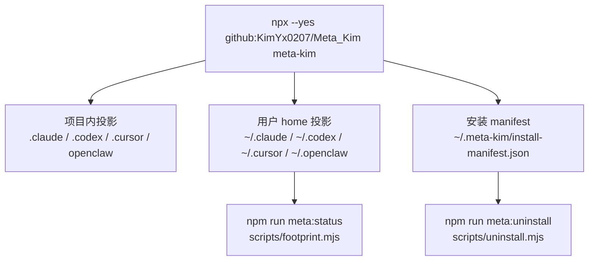

| 落点 | 内容 | 边界 |
|---|---|---|
| 项目内投影 | runtime mirrors、hooks、capability-index | 由 `meta:sync` 生成；不要手改长期行为 |
| 用户 home 投影 | 全局 skills、hooks、commands、plugins | 由安装/更新流程管理；需要 sanitizer 防止 skill 污染 |
| 安装 manifest | 安装足迹、版本、目标 | `meta:status` 和卸载依据 |
| Claude 官方插件 | 走 Claude plugin / marketplace path | 不应把完整插件仓库暴露到普通 `skills/` 扫描根 |
| Codex / OpenClaw / Cursor | 通常走目录镜像或 sparse extraction | 没有 Claude plugin 格式，不能照搬 Claude 语义 |

## 12. Cross-Runtime 能力矩阵

| 能力 | Claude Code | Codex | OpenClaw | Cursor |
|---|---|---|---|---|
| Agent 投影 | `.claude/agents/*.md` | `.codex/agents/*.toml` | `openclaw/workspaces/*` | `.cursor/agents/*.md` |
| Skill 投影 | `.claude/skills/meta-theory/` | `.codex/skills/meta-theory/` | `openclaw/skills/meta-theory/` | `.cursor/skills/meta-theory/` |
| Hooks schema | `.claude/settings.json` | `.codex/hooks.json` + `.codex/hooks/` | `openclaw/hooks/` | `.cursor/hooks.json` + `.cursor/hooks/` |
| MCP 文件 | `.mcp.json` | 项目/宿主能力为主 | OpenClaw template / hook | `.cursor/mcp.json` |
| `/meta-theory` | Claude slash skill | `.codex/commands/` mirror | skill mirror / workspace convention | skill mirror / mode convention |
| Graphify hook | 支持 | 支持项目 hook | 支持安装到目标 repo | 支持项目 hook |
| Memory lifecycle hook | Claude Python + Stop hooks | SessionStart / UserPromptSubmit / Stop bridge | managed `mcp-memory-service` hook | `beforeSubmitPrompt` / `stop` bridge |
| 额外 auth | 通常无 | 通常无 | 可能需要 OpenClaw agent auth hydration | 依赖 Cursor 本地能力 |

## 13. Hooks、MCP 与运行时能力差异

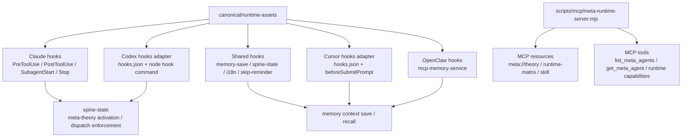

Hooks inventory：

| 层 | 代表脚本/文件 | 触发点 |
|---|---|---|
| Shared hook assets | `canonical/runtime-assets/shared/hooks/` | Codex/Cursor/shared adapter、memory、graphify、i18n 等 |
| Claude hook assets | `canonical/runtime-assets/claude/hooks/` | `PreToolUse`, `PostToolUse`, `SessionStart`, `Stop`, dispatch enforcement |
| Codex project hooks | `.codex/hooks.json`, `.codex/hooks/` | startup/resume、UserPromptSubmit、Stop、HookPrompt adapter |
| Cursor project hooks | `.cursor/hooks.json`, `.cursor/hooks/` | beforeSubmitPrompt、stop、preToolUse adapter |
| OpenClaw hooks | `openclaw/hooks/`, `openclaw/openclaw.template.json` | managed hook / internal plugin model |

MCP 边界：

| 组件 | 作用 | 不是 |
|---|---|---|
| `scripts/mcp/meta-runtime-server.mjs` | 暴露 Meta_Kim runtime matrix、agent/skill resources、meta runtime tools | 不是第三层向量记忆数据库 |
| `.mcp.json` / `.cursor/mcp.json` | 注册 MCP server 给宿主 | 不保证 lifecycle hook 已写入，也不保证 `:8000` 已健康 |
| MCP Memory Service | 本地 HTTP + SQLite/vector 服务 | 不是单纯文件记忆；需要服务进程 |
| lifecycle hooks | 写入和召回记忆 | 不会在服务失败时阻塞宿主 |

## 14. 三层记忆与知识层

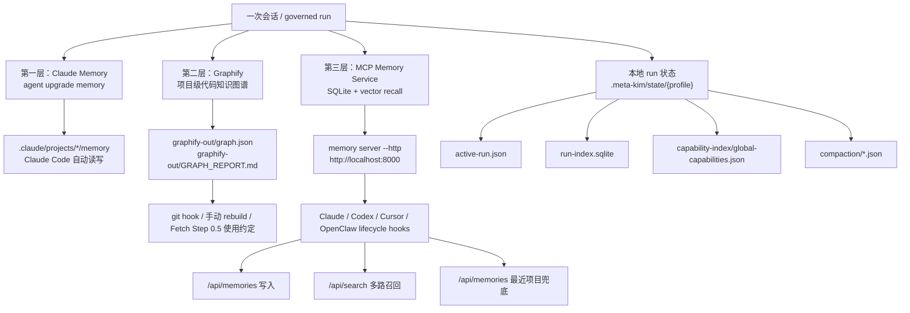

三层记忆的触发方式：

| 层 | 负责什么 | 存储 | 触发方式 | 关键边界 |
|---|---|---|---|---|
| 第一层 Claude Memory | agent 升级、边界调整、Claude Code 运行时连续性 | `~/.claude/projects/*/memory/` | Claude Code 自身机制和 Meta_Kim Claude hooks | 主要属于 Claude Code；Codex/Cursor/OpenClaw 不天然共享 |
| 第二层 Graphify | 项目结构、代码关系、LLM wiki | `graphify-out/` | `node setup.mjs` 可安装 hooks；git hook 或手动 rebuild 生成；Fetch 阶段按约定使用 | 不是后台服务；不会自动把整份 `graph.json` 塞进上下文 |
| 第三层 MCP Memory Service | 跨会话语义检索、向量级 session recall | SQLite + sqlite-vec，由 `mcp-memory-service` 管理 | `node setup.mjs` 安装 hooks 并尝试后台启动；各运行时 lifecycle hook 写入/召回 | 服务必须在 `http://localhost:8000` 健康运行，否则 hooks 不阻塞宿主但记忆召回/写入会失效 |
| 本地 run state | governed run 恢复和审计 | `.meta-kim/state/{profile}/` | run artifact、compaction、index 命令 | 它是连续性证据，不等于长期向量记忆 |

第三层的关键链路：

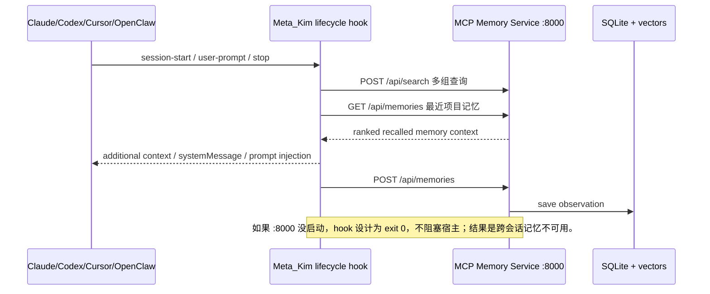

所以“跨会话时必须提醒去 `8000` 端口”不是单一问题。这里有两类产品边界：

| 问题类型 | 现象 | 根因 | 修复策略 |
|---|---|---|---|
| 服务健康问题 | `8000` 打不开，hook 静默跳过 | 安装 hooks 不等于 MCP Memory Service 常驻健康 | hook 先查 `/api/health`，本地端点不健康时尝试后台启动 `memory server --http`，失败则注入节流状态提示 |
| 召回质量问题 | `8000` 明明健康，但不提示端口/关键词就想不起来 | hook 只按当前提示词或项目名做一次 `/api/search`，泛提示会召回启动日志等低价值记忆 | 改为多路查询、最近项目记忆兜底、项目命中/新鲜度/问题词排序，并降权或过滤 session-start 启动日志 |

因此第三层不能只写成“服务开了就会记住”。更准确的链路是：服务健康只是前置条件，hook 还必须把正确的历史片段召回并注入宿主上下文。

第三层自愈策略：

| 阶段 | 行为 |
|---|---|
| hook 启动 | 检查 `MCP_MEMORY_URL` 或默认 `http://localhost:8000` 的 `/api/health` |
| 本地服务不健康 | 尝试后台执行 `memory server --http`，并设置 `MCP_ALLOW_ANONYMOUS_ACCESS=true` |
| 启动成功 | 继续 `/api/search` 召回和 `/api/memories` 写入 |
| 启动失败 | 不阻塞宿主；Codex/Cursor/Claude SessionStart 注入“第三层记忆不可用”的状态提示，Stop/OpenClaw 只跳过写入 |
| 用户关闭自愈 | 设置 `META_KIM_DISABLE_MEMORY_AUTOSTART=1` |

第三层召回策略：

| 阶段 | 行为 |
|---|---|
| 主查询 | 使用当前 prompt 或项目名查询 `/api/search` |
| 扩展查询 | 追加项目相关的 current problems、decisions、next steps、bugs、hooks、memory recall 等查询 |
| 最近兜底 | 读取 `/api/memories?limit=...`，筛选当前项目的最近记忆 |
| 排序 | 项目命中、新鲜度、相似度、问题词命中加权；session-start 启动日志降权 |
| 注入 | 只以“不可信历史摘录”形式注入，避免把记忆内容当成新指令 |

本地状态层单独看：

| 路径 | 作用 |
|---|---|
| `.meta-kim/local.overrides.json` | 当前机器的 active runtime targets |
| `.meta-kim/state/{profile}/profile.json` | profile 元数据 |
| `.meta-kim/state/{profile}/run-index.sqlite` | governed run 索引 |
| `.meta-kim/state/{profile}/compaction/` | 跨会话交接包 |
| `.meta-kim/state/{profile}/capability-index/` | 本机能力发现缓存 |
| `.meta-kim/state/{profile}/doctor-cache/` | doctor / validate 缓存 |
| `.meta-kim/state/{profile}/migrations/` | 状态迁移记录 |
| `~/.meta-kim/install-manifest.json` | 全局安装足迹 |

## 15. Graphify 作为架构证据与新鲜度门

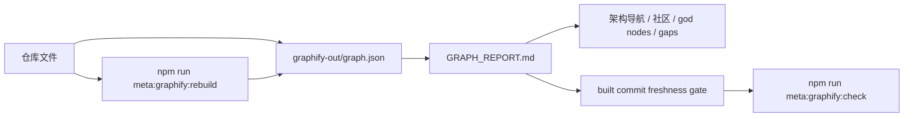

当前 `GRAPH_REPORT.md` 证据：

| 指标 | 数值 |
|---|---|
| 文件数 | 1023 |
| 词数 | 约 936,881 |
| nodes | 26,208 |
| edges | 29,574 |
| communities | 1,311 |
| extraction | 98% extracted, 2% inferred, 0% ambiguous |
| built commit | `1c54d7b4` |

广泛架构问题优先读 `graphify-out/GRAPH_REPORT.md`；如果 `graphify-out/wiki/index.md` 存在，再用 wiki 导航。修改代码后要运行 `npm run meta:graphify:rebuild`；`npm run meta:graphify:check` 会比较图谱 built commit 和当前 HEAD。

## 16. 验证与发布闭环

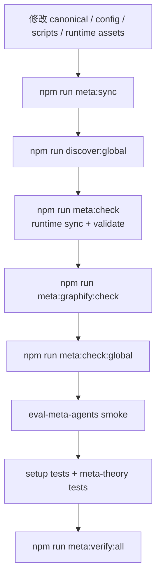

常用命令：

| 命令 | 何时使用 |
|---|---|
| `npm run meta:sync` | 改 canonical 后生成 runtime mirrors |
| `npm run meta:validate` | 检查合约、runtime、graphify、MCP 自检 |
| `npm run meta:test:setup` | 安装器、同步器、hook、runtime 配置测试 |
| `npm run meta:test:meta-theory` | meta-theory 合约和运行协议测试 |
| `npm run meta:verify:all` | 发布前完整验证 |
| `npm run meta:graphify:rebuild` | 修改代码后重建知识图谱 |

## 17. 目录速查

| 路径 | 性质 | 说明 |
|---|---|---|
| `canonical/agents/` | 正典源 | 9 个 meta agent 的长期身份与边界 |
| `canonical/skills/meta-theory/` | 正典源 | meta-theory skill、治理规则和 references |
| `canonical/runtime-assets/` | 正典源 | hooks、settings、OpenClaw template、Codex config template |
| `config/contracts/` | 正典源 | workflow、evolution、skills manifest 等合约 |
| `config/capability-index/` | 正典源 | repo canonical capability index |
| `.claude/` | 生成投影 | Claude Code agents / skills / hooks / capability-index |
| `.codex/` | 生成投影 | Codex agents / skills / hooks / commands / capability-index |
| `openclaw/` | 生成投影 | OpenClaw workspaces / skills / hooks / template |
| `.cursor/` | 生成投影 | Cursor agents / skills / hooks / MCP / capability-index |
| `.meta-kim/state/` | 本地状态 | profile、run index、capability inventory、compaction |
| `graphify-out/` | 生成知识图谱 | `graph.json`、`GRAPH_REPORT.md`，不作为 canonical prompt 源 |
| `scripts/` | 工具层 | 安装、同步、验证、MCP、graphify、memory、run index |
| `tests/` | 验证层 | setup、meta-theory、integration、unit 测试 |

## 18. 架构原则

1. 正典源优先：长期行为改 `canonical/` 或 `config/`，不要手改 runtime mirror。
2. 能力优先：先描述能力缺口，再查 capability index / runtime inventory / skills / tools。
3. 运行时投影不是主源：Claude、Codex、OpenClaw、Cursor 都是同一 canonical 层的投影。
4. Meta agent 只治理：meta agents 不应退化成普通实现工人。
5. 具体 child skill 只在当前 run 选择：不要把 `superpowers/<child>`、`ecc:<child>` 固化进长期 agent 身份。
6. 11 阶段只在复杂任务或显式要求时升级：普通任务看不到完整业务工作流是设计结果，但复杂 run 必须留下 packet 证据。
7. 第三层记忆必须健康检查：hooks 自动注册不等于 `http://localhost:8000` 一定可用。
8. 发布必须闭环：sync、validate、graphify freshness、global check、setup tests、meta-theory tests 都要过。
